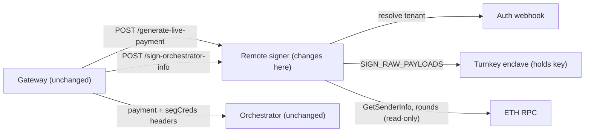

# Turnkey-backed remote signer for offchain tickets

## The binding constraint: the signature format cannot change

I dumped the deployed `TicketBroker` ABI from the bindings in this repo:

```
redeemWinningTicket(tuple,bytes,uint256) nonpayable
batchRedeemWinningTickets(tuple[],bytes[],uint256[]) nonpayable
getTicketHash(tuple) pure
fundDeposit / fundReserve / fundDepositAndReserveFor / unlock / withdraw / usedTickets ...
```

There is **no `isApprovedSigner`, no signer registry, and no ERC-1271 hook**. On redemption the contract does `ECDSA.recover(toEthSignedMessageHash(ticketHash), sig)` and requires the recovered address to equal `ticket.sender`, the address that owns the deposit and reserve. Off-chain this is mirrored in [pm/validator.go](../../pm/validator.go) and [crypto/verify.go](../../crypto/verify.go), which reject anything that is not 65 bytes, low-S, with `v` in {27,28}.

Two consequences:

- A remote-attestation quote, a BLS signature, or any other "no raw key" signature type is **not redeemable on-chain**. It would require a new TicketBroker deployment plus a coordinated orchestrator upgrade, because the orchestrator both verifies the sig locally and submits those same bytes on-chain.
- The winning lottery is computed over the signature bytes themselves — `keccak256(sig ‖ recipientRand) < winProb` in [pm/validator.go](../../pm/validator.go) — so even the signature's *encoding* is protocol-relevant, on both sides.

What *is* achievable today, and what actually satisfies the goal, is to keep the signature byte-identical and change **who holds the key**. Turnkey generates and decrypts the secp256k1 key only inside an attested secure enclave; it is never exported to the operator, the operator's process, or Turnkey. The user is the root-quorum owner of a Turnkey sub-organization and can revoke the operator's delegated API key unilaterally with their passkey. Turnkey's `ACTIVITY_TYPE_SIGN_RAW_PAYLOADS` returns `{r, s, v}` over a caller-supplied payload with `HASH_FUNCTION_KECCAK256`, which reproduces exactly what [eth/accountmanager.go](../../eth/accountmanager.go) produces today.

## What changes where



- **Orchestrator: no changes.** Wire format, `ProcessPayment`, `ReceiveTicket`, and on-chain redemption are untouched.
- **Gateway: no changes.** In remote-signer mode it already holds no key: `broadcaster.Sign` returns `[]byte{}` when `node.Eth == nil`, and `Address()`/`OrchInfoSig()` return the cached `RemoteEthAddr`/`InfoSig` fetched from the signer at startup ([core/broadcaster.go](../../core/broadcaster.go), [cmd/livepeer/starter/starter.go](../../cmd/livepeer/starter/starter.go)).
- Everything else is in [server/remote_signer.go](../../server/remote_signer.go), [pm/signer.go](../../pm/signer.go), [pm/sender.go](../../pm/sender.go), and a new signer-backend package.

## 1. Turnkey signer backend

New package (e.g. `eth/turnkey`) with a type implementing `pm.Signer`, built on `github.com/tkhq/go-sdk/v2 v2.1.0` (verified available on the module proxy). Configured per tenant with: Turnkey org/sub-org ID, wallet account address, and the operator's delegated P-256 API key (`turnkey.NewAPIKeyStamper`).

`Account()` returns the configured wallet address without a network call. `Sign(msg)` submits `signRawPayloads` with `encoding: PAYLOAD_ENCODING_HEXADECIMAL`, `hashFunction: HASH_FUNCTION_KECCAK256`, and `payload` set to the EIP-191 pre-image so Turnkey performs the hash:

```go
prefix := []byte(fmt.Sprintf("\x19Ethereum Signed Message:\n%d", len(msg)))
payload := append(prefix, msg...)
```

Prefer `KECCAK256` over `NO_OP`: it is the only variant where Turnkey sees the pre-image, which is a prerequisite for the payload-scoped policy described in §6.

Then reassemble and harden the result:

- 65 bytes as `r ‖ s ‖ v`, with `v` normalized to 27/28.
- Enforce low-S; reject rather than silently flipping `s`, since flipping changes the sig bytes and therefore changes the ticket's win/lose outcome.
- Verify locally with `lpcrypto.VerifySig(a.Account().Address, msg, sig)` before returning, and fail closed. This makes the boundary self-checking and matches what the orchestrator and the contract will do.

**Do not retry by re-signing.** Because the lottery reads the signature bytes, re-signing the same ticket hash and choosing among results is signature grinding. Retries must be idempotent per ticket hash: cache by `ticket.Hash()` within a request, and on transient failure either reuse the cached signature or fail the whole batch.

## 2. Batch signing in `pm`

[server/remote_signer.go](../../server/remote_signer.go) permits up to 100 tickets per request (`balUpdate.NumTickets > 100` is the ceiling), and `CreateTicketBatch` currently signs one at a time:

`pm/sender.go` L161-170:

```go
	for i := 0; i < size; i++ {
		senderNonce := atomic.AddUint32(&session.senderNonce, 1)
		ticket := NewTicket(&session.ticketParams, expirationParams, s.signer.Account().Address, senderNonce)
		sig, err := s.signer.Sign(ticket.Hash().Bytes())
		if err != nil {
			return nil, errors.Wrapf(err, "error signing ticket for session: %v", sessionID)
		}

		batch.SenderParams = append(batch.SenderParams, &TicketSenderParams{SenderNonce: senderNonce, Sig: sig})
	}
```

100 sequential round trips to Turnkey is not viable. Add `SignBatch(msgs [][]byte) ([][]byte, error)` to `pm.Signer` and rewrite the loop to build all tickets first, then sign once. Implement it on `eth.client` as a loop over `accountManager.Sign`, on the Turnkey backend as one `signRawPayloads` call, and on `pm.stubSigner` / `eth.StubClient`. The `paymentRequestTimeout` of 1 minute in [server/live_payment.go](../../server/live_payment.go) leaves ample headroom for one API call.

The segment-credential signature in `genSegCreds` ([server/segment_rpc.go](../../server/segment_rpc.go)) is a second signature per request. Simplest is a separate `Sign` call issued concurrently with the ticket batch; folding it into the same `signRawPayloads` call would require threading the digest through `genPayment`, which is not worth it initially.

## 3. Stop signing the state blob with an ETH key

`signState` / `verifyStateSignature` use the node's ETH key purely so the signer can authenticate its own opaque state blob back to itself:

`server/remote_signer.go` L276-281:

```go
func signState(ls *LivepeerServer, stateBytes []byte) ([]byte, error) {
	if ls == nil || ls.LivepeerNode == nil || ls.LivepeerNode.Eth == nil {
		return nil, fmt.Errorf("ethereum client not configured for remote signer")
	}
	sig, err := ls.LivepeerNode.Eth.Sign(stateBytes)
```

Replace with an HMAC-SHA256 over a process-local secret. This removes a Turnkey round trip from every request, and once the signer is multi-tenant a user's key should not be authenticating operator-internal state at all. The HMAC must cover the resolved tenant identity so one tenant cannot replay another's state.

## 4. Multi-tenancy (the largest change)

Today the remote signer is single-key by construction: `n.Sender`, `n.Balances`, `n.Eth.Account().Address`, and `n.InfoSig` are all process-global, and `RemotePaymentState` carries no sender identity. To let each user pay from their own deposit and reserve, introduce a per-tenant bundle and a registry keyed on the authenticated caller:

```go
type tenant struct {
	Address  ethcommon.Address
	Signer   pm.Signer
	Sender   pm.Sender
	Balances *core.AddressBalances
	InfoSig  []byte
}
```

Each tenant gets its own `pm.NewSender(tenantSigner, timeWatcher, senderWatcher, ...)`, mirroring [cmd/livepeer/starter/starter.go](../../cmd/livepeer/starter/starter.go). `SenderWatcher.GetSenderInfo` in [eth/watchers/senderwatcher.go](../../eth/watchers/senderwatcher.go) is already address-agnostic and lazily caches per address, so deposit and reserve validation works per tenant with no watcher changes.

Concrete edits in [server/remote_signer.go](../../server/remote_signer.go):

- `SignOrchestratorInfo` resolves the tenant and returns that tenant's address plus a lazily computed, cached `InfoSig` (one Turnkey call per tenant, ever — it is a static signature over the address string).
- `GenerateLivePayment` takes `Sender`/`Balances` from the tenant instead of `ls.LivepeerNode`, and the `TODO avoid using the global Balances` comment at the top of the handler becomes the actual fix.
- `RemotePaymentState` gains a sender-address field, checked against the resolved tenant on every stateful request alongside the existing orchestrator/app/type mismatch checks.
- `StartRemoteSignerServer` no longer signs a global `InfoSig` at boot.
- The `create_signed_ticket` monitoring event gains the sender address.

**Ordering decision to settle:** `authLivePayment` currently runs *after* tickets are generated, so it can pass the updated state to the webhook. Tenant resolution has to happen *before* signing. Either move the auth call to the top of the handler (changing what the webhook sees), or split it into an early tenant-resolution call and a late price/expiry call. Extending `authResponse` with the tenant's Turnkey sub-org ID and wallet address is the natural fit, since the operator's control plane already maps `Signer-Auth-Id` to a user there.

## 5. Configuration

New flags alongside the existing `-remoteSigner*` set in [cmd/livepeer/starter/flags.go](../../cmd/livepeer/starter/flags.go): Turnkey API base URL, operator API key public/private key (via secret or file, never a CLI literal), and default org ID. Per-tenant sub-org and wallet address come from the auth webhook rather than static config.

The remote signer still needs `eth.NewClient` with a local account for read-only chain access (rounds, block hashes, `GetSenderInfo`). Keep a local operator keystore key for that; it never needs funding and never signs tickets. That keeps this change out of `eth/client.go` entirely.

## 6. Residual custody gap — state it plainly

Turnkey's policy engine exposes only `hash_function` and `encoding` for `ACTIVITY_TYPE_SIGN_RAW_PAYLOAD(S)`; the payload contents are **not** available to policy conditions. So a delegated key that can sign arbitrary keccak256 payloads can also sign an Ethereum transaction calling `unlock()` and `withdraw()`. The improvement over today is real but bounded:

- The operator never possesses exportable key material, so access ends the moment the user revokes it — unlike a keystore file, which is compromised forever.
- Policies restrict the delegated user to `SIGN_RAW_PAYLOADS` only, denying `SIGN_TRANSACTION`, `EXPORT_WALLET`, `EXPORT_PRIVATE_KEY`, `CREATE_API_KEYS`, and `UPDATE_ROOT_QUORUM`. DENY overrides ALLOW, so a DENY-all-signing policy works as a circuit breaker.
- Every signature is recorded in Turnkey's tamper-evident audit trail, so misuse is detectable rather than silent.
- The user holds the root quorum and can revoke unilaterally.

Two ways to close the gap properly, neither of which blocks the work above:

- **Ask Turnkey to expose `payload` in policy conditions** for `SIGN_RAW_PAYLOADS` — their docs explicitly invite these requests. A condition requiring the payload to begin with `0x19457468657265756d205369676e6564204d6573736167653a0a3332` (the EIP-191 prefix for a 32-byte message) structurally excludes every Ethereum transaction encoding, since legacy RLP starts with `0xf8`/`0xf9` and typed transactions with `0x02`/`0x03`. This is the single highest-leverage ask, and it is why §1 chooses `KECCAK256` over `NO_OP`.
- **Add an approved-signer registry to `TicketBroker`.** This repo already anticipates it: [pm/sigverifier.go](../../pm/sigverifier.go) carries a fully commented-out `ApprovedSigVerifier` calling `broker.IsApprovedSigner(addr, rec)`. The user would keep their funding key cold and approve a separate hot signing key, giving the operator zero withdrawal power. It requires a contract deployment plus orchestrator-side changes on the whole network, so it is a protocol project, not a gateway change.

Turnkey's 2-of-2 co-signing quorum is not an alternative here: it requires the user to approve each signing activity interactively, which defeats an always-on hosted signer.

## Verification

Unit tests for the signer backend against a stubbed Turnkey HTTP endpoint, asserting the assembled 65-byte signature verifies via `lpcrypto.VerifySig` and matches `eth/accountmanager.go` output for the same key and message. Extend [server/remote_signer_test.go](../../server/remote_signer_test.go) with per-tenant isolation cases: tenant A's state rejected for tenant B, and per-tenant balance accounting. A cross-check test that a Turnkey-produced ticket signature passes `pm.validator.ValidateTicket` and yields the same `IsWinningTicket` result as a locally signed one for the same key confirms end-to-end compatibility.
