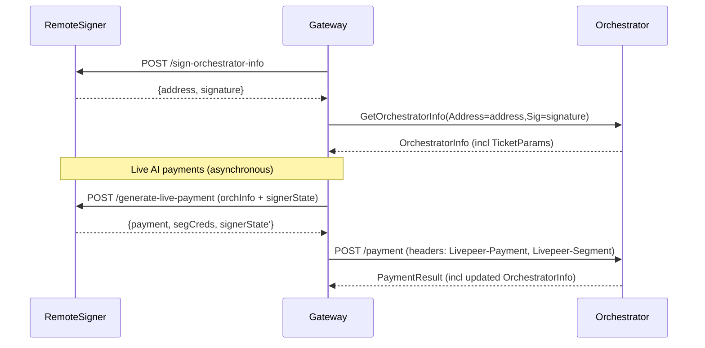
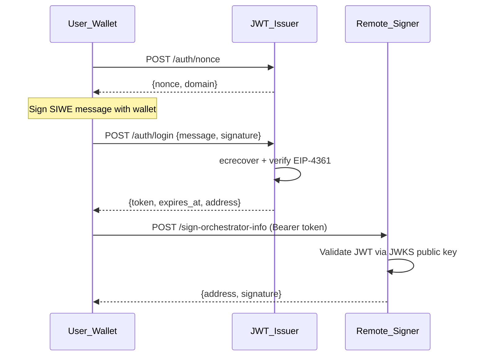

# Remote signer

The **remote signer** is a standalone `go-livepeer` node mode that separates **Ethereum key custody + signing** from the gateway’s **untrusted media handling**. It is intended to:

- Improve security posture by removing Ethereum hot keys from the media processing path
- Enable web3-less gateway implementations natively on additional platforms such as browser, mobile, serverless and embedded backend apps
- Enable third-party payment operators to manage crypto payments separately from those managing media operations.

## Current implementation status

Remote signing was designed to initially target **Live AI** (`live-video-to-video`).

Support for other workloads may be added in the future.

The on-chain service registry is not used for Live AI workloads right now, so orchestrator discovery is not implemented as part of the remote signer. The gateway can learn about orchestrators via an orchestrator webhook (`-orchWebhookUrl`) or a static list (`-orchAddr`).

This allows a gateway to run in offchain mode while still working with on-chain orchestrators.

## Architecture

At a high level, the gateway uses the remote signer to handle Ethereum-related operations such as generating signatures or probabilistic micropayment tickets:



## Usage

### Remote signer node

Start a remote signer by enabling the mode flag:

- `-remoteSigner=true`: run the remote signer service

The remote signer is intended to be its own standalone node type. The `-remoteSigner` flag cannot be combined with other mode flags such as `-gateway`, `-orchestrator`, `-transcoder`, etc.

**The remote signer requires an on-chain network**. It cannot run with `-network=offchain` because it must have on-chain Ethereum connectivity to sign and manage payment tickets.

The remote signer must have typical Ethereum flags configured (examples: `-network`, `-ethUrl`, `-ethController`, keystore/password flags). See the go-livepeer [devtool](https://github.com/livepeer/go-livepeer/blob/92bdb59f169056e3d1beba9b511554ea5d9eda72/cmd/devtool/devtool.go#L200-L212) for an example of what flags might be required.

The remote signer listens to the standard go-livepeer HTTP port (8935) by default. To change the listening port or interface, use the `-httpAddr` flag.

Example (fill in the placeholders for your environment):

```bash
./livepeer \
  -remoteSigner \
  -network mainnet \
  -httpAddr 127.0.0.1:7936 \
  -ethUrl <eth-rpc-url> \
  -ethPassword <password-or-password-file>
  ...
```

### Gateway node

Configure a gateway to use a remote signer with:

- `-remoteSignerUrl <url>`: base URL of the remote signer service (**gateway only**)

If `-remoteSignerUrl` is set, the gateway will query the signer at startup and fail fast if it cannot reach the signer.

**No Ethereum flags are necessary on the gateway** in this mode. Omit the `-network` flag entirely here; this makes the gateway run in offchain mode, but it will still be able to send work to on-chain orchestrators with the `-remoteSignerUrl` flag enabled.

By default, if no URL scheme is provided, https is assumed and prepended to the remote signer URL. To override this (eg, to use a http:// URL) then include the scheme, eg `-remoteSignerUrl http://signer-host:port`

Example:

```bash
./livepeer \
  -gateway \
  -httpAddr :9935 \
  -remoteSignerUrl http://127.0.0.1:7936 \
  -orchAddr localhost:8935 \
  -v 6
```

### Pricing checks (gateway vs remote signer)

When running a gateway in offchain mode (ie, with `-remoteSignerUrl` and no Ethereum flags), the gateway does not check orchestrator pricing. Instead, price checks happen in the remote signer during payment generation.

- **Remote signer configuration**: configure the signer with the same pricing and PM knobs you would normally configure on a gateway, e.g.:
  - `-maxPricePerUnit`, `-pixelsPerUnit`
  - `-maxPricePerCapability` (optional, capability/model pricing config)
  - `-maxTicketEV`, `-maxTotalEV`, etc.
- **Selection behavior**: if an orchestrator’s price is above the signer’s configured limits, the signer rejects the request (HTTP 481) and the gateway will retry with a different orchestrator session.
- **LV2V session price is fixed**: like a traditional gateway setup, Live Video-to-Video (LV2V) jobs treat price as fixed for the lifetime of the session, captured at session initialization time.

### Tuning ticket EV to avoid “too many tickets” errors

If there are errors about too many tickets (eg `numTickets ... exceeds maximum of 100`), increase the ticket EV on the remote signer so each signing call produces fewer tickets. A good target is ~1–3 tickets per remote signer call.

For PM configuration details and how these knobs interact, see `doc/payments.md`.

## Authentication

The remote signer supports JWT-based authentication so it can be exposed to authenticated end-users (e.g., desktop app users) rather than requiring private-network-only deployment.

Users authenticate with a separate **jwt-issuer** service via Sign-In With Ethereum (EIP-4361 / SIWE). The jwt-issuer verifies wallet signatures and issues RS256 JWTs. The remote signer validates these JWTs by fetching the public key from the jwt-issuer's JWKS endpoint.



See [github.com/livepeer/jwt-issuer](https://github.com/livepeer/jwt-issuer) for the auth service and [quickstart-remote-signer-web3.md](quickstart-remote-signer-web3.md) for a full deployment walkthrough.

### Configuration flags

Authentication is **opt-in**. If `-remoteSignerJWKSUrl` is not set, the remote signer runs without authentication (for private-network deployments).

| Flag | Use case |
|------|----------|
| `-remoteSignerJWKSUrl <url>` | JWKS endpoint for JWT verification (RS256), recommended for production (with jwt-issuer or any JWKS-serving auth service) |

### JWT claims format

The remote signer expects JWTs with the following claims:

```json
{
  "sub": "0xUserWalletAddress",
  "iss": "https://livepeer.ai",
  "aud": "livepeer-remote-signer",
  "exp": 1735689600,
  "iat": 1735603200,
  "jti": "unique-token-id",
  "scope": "sign:orchestrator sign:payment sign:byoc",
  "spending_cap_wei": "1000000000000000000",
  "tier": "standard"
}
```

Required claims:
- `sub` (subject): The user's Ethereum wallet address (e.g., `0xAbCd...`). Used for identity and accounting.
- `aud` (audience): Must be `"livepeer-remote-signer"`. Tokens with a different audience are rejected.
- `exp` (expiration): Token expiry timestamp. Expired tokens are rejected.

Optional/informational claims (present for future use, not yet enforced by the signer):
- `scope`: Space-separated list of allowed operations.
- `spending_cap_wei`: Per-session spending limit in wei.
- `tier`: User service tier.

### JWT verification (JWKS only)

The auth website publishes its public keys at a JWKS endpoint. The remote signer fetches and caches these keys, with automatic background refresh (every hour). This is the standard approach for production deployments where the auth website uses RSA or EC keys to sign JWTs.

```bash
./livepeer \
  -remoteSigner \
  -remoteSignerJWKSUrl https://livepeer.ai/.well-known/jwks.json \
  -network mainnet \
  -httpAddr 0.0.0.0:7936 \
  -ethUrl <eth-rpc-url> \
  -ethPassword <password-or-password-file>
```

### Calling authenticated endpoints

Once authentication is enabled, all remote signer endpoints require a valid JWT in the `Authorization` header:

```bash
curl -X POST http://localhost:7936/sign-orchestrator-info \
  -H "Authorization: Bearer <JWT_TOKEN>" \
  -H "Content-Type: application/json"
```

Unauthenticated requests receive a `401 Unauthorized` response.

### Deployment guide: end-to-end SIWE + JWT setup

This section describes how to deploy the full authentication flow for a use case like ComfyUI desktop app users.

**Components:**

1. **Auth website** (e.g., livepeer.ai) -- issues JWTs after SIWE login. This is separate infrastructure, not part of go-livepeer.
2. **Remote signer** (go-livepeer with `-remoteSigner`) -- validates JWTs and signs on behalf of authenticated users.
3. **Gateway** (go-livepeer with `-gateway`) -- routes media work, delegates signing to the remote signer.
4. **Desktop app** (e.g., ComfyUI) -- the end-user client that holds the JWT token.

**Step 1: Set up the auth website**

The auth website needs to:
- Serve a SIWE login flow (connect wallet, sign message, verify signature)
- Issue JWTs signed with its private key, containing the user's ETH address as `sub` and `"livepeer-remote-signer"` as `aud`
- Publish public keys at a JWKS endpoint (e.g., `/.well-known/jwks.json`)

Libraries: [siwe](https://github.com/spruceid/siwe) (JS/Go/Rust), [golang-jwt](https://github.com/golang-jwt/jwt) for JWT signing, any JWKS server library.

**Step 2: Start the remote signer with authentication**

```bash
./livepeer \
  -remoteSigner \
  -remoteSignerJWKSUrl https://your-auth-website.com/.well-known/jwks.json \
  -network mainnet \
  -httpAddr 0.0.0.0:7936 \
  -ethUrl <eth-rpc-url> \
  -ethPassword <password-or-password-file> \
  -maxPricePerUnit 1200 \
  -pixelsPerUnit 1
```

**Step 3: Start the gateway pointing to the remote signer**

```bash
./livepeer \
  -gateway \
  -httpAddr :9935 \
  -remoteSignerUrl http://signer-host:7936 \
  -orchAddr orchestrator:8935
```

**Step 4: User workflow (ComfyUI example)**

1. User opens the auth website in a browser
2. Connects their Ethereum wallet (MetaMask, WalletConnect, etc.)
3. Signs a SIWE message: "Sign in to Livepeer Remote Signer Service"
4. The auth website verifies the signature and returns a JWT token
5. User copies the JWT token and pastes it into their ComfyUI node configuration
6. ComfyUI sends requests to the remote signer (or gateway) with the JWT in the `Authorization: Bearer <token>` header

### Token lifetime and revocation

JWTs are validated locally, so there is no real-time revocation mechanism. Security is managed through short token lifetimes:

- **Recommended token lifetime**: 1-24 hours depending on risk tolerance
- **Refresh flow**: The auth website can implement a refresh token mechanism so users don't need to re-authenticate frequently
- **Revocation**: If a token needs to be revoked before expiry, rotate the signing keys on the auth website. The remote signer's JWKS cache refreshes hourly by default.

## Operational + security guidance

When authentication is enabled (via `-remoteSignerJWKSUrl`), the remote signer can be safely exposed to authenticated end-users over the network. All requests are validated against the JWT before any signing operation is performed. The authenticated user's Ethereum address is logged with each request for audit purposes.

When authentication is **not** enabled, remote signers should sit behind infrastructure controls rather than being exposed directly to end-users. For example, run the remote signer on a private network or behind an authenticated proxy. Do not expose an unauthenticated remote signer to end-users. Run the remote signer close to gateways on a private network; protect it like you would an internal wallet service.

Remote signers are stateless, so signer nodes can operate in a redundant configuration (eg, round-robin DNS, anycasting) with no special gateway-side configuration.
